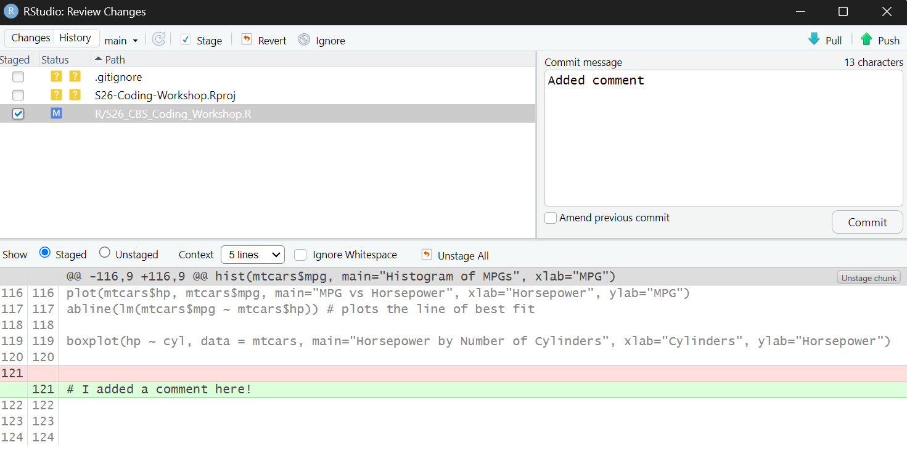

# S26-Coding-Workshop

Welcome to the Spring '26 Intro to GitHub & Coding Workshop!

In this workshop, CBS members will learn:
- The fundamentals of Git and GitHub workflow
- The fundamentals of R programming
- How to contribute to a programming project on a shared repository (via RStudio)

First, make sure you have Git downloaded. Download the correct version based on your operating system here: https://git-scm.com/install/

Please also make sure you have RStudio downloaded. Download R and RStudio here: https://posit.co/download/rstudio-desktop

Here's a GitHub tutorial you can also refer to: https://docs.github.com/en/get-started/start-your-journey/hello-world

---

## Git Workflow
### 1. Create your own copy of the repository
#### Forking
Forking allows you to create a copy of an existing repository on your own account. This lets you make your own changes without changing the original repository.  
Let's try forking this repository! Click the fork button at the top right corner of this workshop repository to create your own copy.  

#### Cloning
Cloning creates a version of the repository on your computer so you can make edits locally.  
You can do this directly on RStudio to clone your forked repository to your local machine. On your GitHub fork, click on the green code button and copy url as shown below.  

Open RStudio and select **File** then **New Project**. Then select **Version Control**, **Git**, and copy your repo url in the Clone Git Repository Page Select the folder you want to keep the repository on. Finally, select **Create Project**. Your environment should have the file structure below.  

### 2. Make and save changes
Now that you're working on your local forked repository, let's practice some programming skills!  
In RStudio, open the R folder in the repo structure, and select the **S26_CBS_Coding_Workshop.R** file. Now, let's practice some R programming!  

### 3. Stage, commit, and push to GitHub
Returning back to the Git tutorial, RStudio has a helpful interface to work with git commands to save changes. You can use the RStudio terminal and use the usual git commands (git add, git commit, git push), but this tutorial will go over the RStudio interface for Git.  

Once you make the changes to your R file, select the **Git** dropdown and **History** as shown in the image below.

This will open up a window for you to review changes in RStudio. Select the **History** tab in the new window, and select the checkbox next to the file you made changes to. Select **Staged** to see the changes you want to include when you update your repo. Since we want to include all our changes, select **Stage** at the top of the window. Then, we want to save a snapshot of our changes with a message describing our edits. Enter your message in the box and select **Commit**. Finally, to upload your work to your forked repository, select **Push** at the top of the window. Once you successfully push, you can see the changes you made on your forked GitHub repository.

**Tip:** If you're getting an error saying "Invalid username or token", you may need to create a Personal Access Token. In your GitHub profile, Go to Settings -> Developer Settings (at the bottom left) -> Personal Access Tokens. Then generate a token (classic), give access to repo, and set expiration to 7 days. Paste the token when prompted and this should solve the error.

### 4. Open a pull request
When using GitHub for collaborative projects, users upload their changes back to the main repository. To submit your work to be added to the main repository, you have to send a pull request.  

First, go to your fork on GitHub. Then, click on **Pull Requests**, and **Create pull request** as shown below.  
  
Your pull request will be reviewed and merged to the main repository.  

### 5. Sync your local repo
Now that we've made changes to our main repository, we want to reflect those changes on our local files. To do this, go to your forked repository and select 
