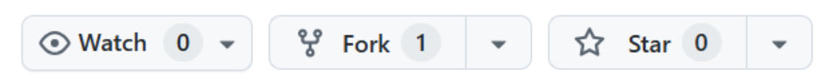
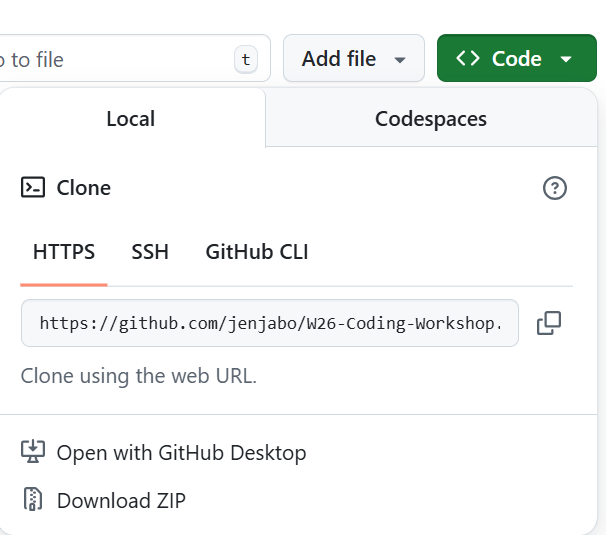

# S26-Coding-Workshop

Welcome to the Spring '26 Intro to GitHub & Coding Workshop!

In this workshop, CBS members will learn:
- The fundamentals of Git and GitHub workflow
- The fundamentals of R programming
- How to contribute to a programming project on a shared repository (via RStudio)

First, make sure you have Git downloaded. Download the correct version based on your operating system here: https://git-scm.com/install/

Please also make sure you have RStudio downloaded. Download R and RStudio here: https://posit.co/download/rstudio-desktop

Here's a GitHub tutorial you can also refer to: https://docs.github.com/en/get-started/start-your-journey/hello-world

---

## Git Workflow
### 1. Create your own copy of the repository
#### Forking
Forking allows you to create a copy of an existing repository on your own account. This lets you make your own changes without changing the original repository.  
Let's try forking this repository! Click the fork button at the top right corner of this workshop repository to create your own copy.  

#### Cloning
Cloning creates a version of the repository on your computer so you can make edits locally.  
To find your fork url, click on the green code button and copy url as shown below.  

